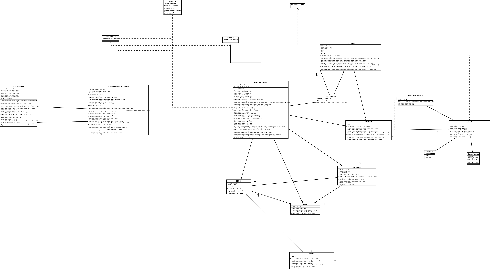

SCRABBLE

ALUMNO: TOBIAS AVILA
LEGAJO: 195327

Scrabble es un juego de palabras clásico y divertido.  El objetivo del juego es obtener la mayor cantidad de puntos al formar palabras en un tablero que se conecten a las palabras creadas por los otros jugadores.
Para jugar Scrabble, necesitas al menos otro jugador. Al jugar el juego, crearás palabras, acumularás puntos, desafiarás a tus oponentes e incluso intercambiarás azulejos (si los tuyos no te sirven).
Al mismo tiempo, un anotador calculará los puntos de cada jugador para determinar quién ganará al final del juego.

